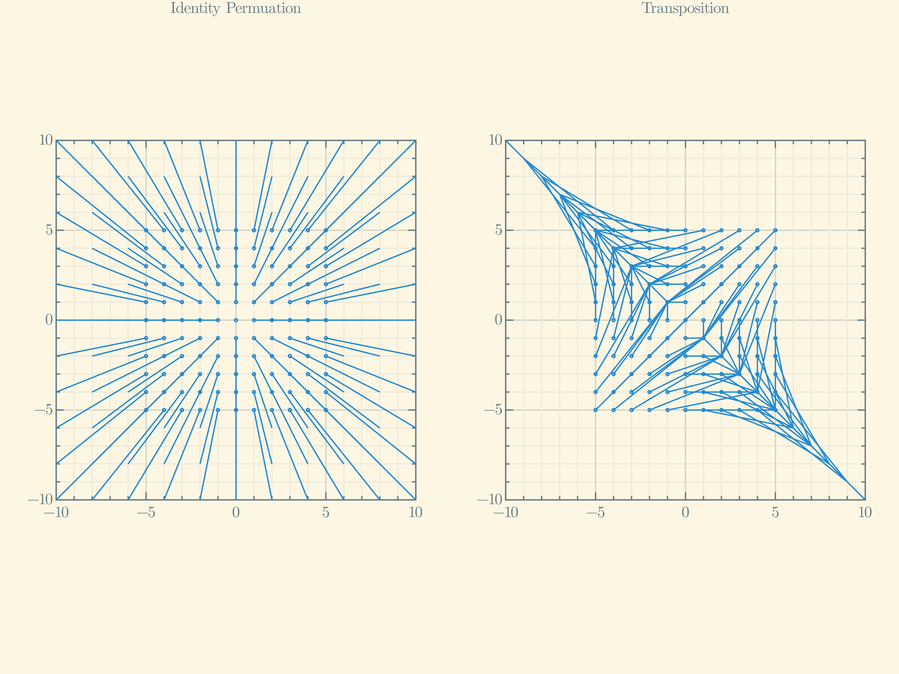

welcome !
====

I am jojo. I draw, dance, surf, ski, cook, love, play, experiment, build, ...

I program too, it can be a delighting. often i am 
- making pictures or animations depicting ~data~, functions, ...
- building and trying out methods or strategies to answer a question or solve a problem 
- exploring the sounds of sequeneces of some bytes 

most of the time programming, is playing or exploring. i am a beginner. exciting!

i run a pretty experimental 'shop' so the dress code is fairly casual.
i dont mind too much.
it does pain me to look back at experiments gone awry, especially reflecting attitudes or a character distracting from or missing certain important aspects of the experience.
but thats life and how it be regardless of much else. 

ideally, the [stuff](https://github.com/jaboaf?tab=repositories) i share is accessible and digestible and not used for evil or undue detriment; and that i share stuff accessibly and digestibly and not maliciously. alas, 'public' will do. in the mean time if you have a thought or question abt something you come across feel free to [reach out](contacting.md)

lingos: French, English, F# (2017), Java (2017-8), Python (2018-9), Julia (2019-), math

i hope to explore computer programming in: Fortran 77, REBOL, C, Postscript, FORTH, Prolog, NDL or a successor

i hope to have a computer running FreeDOS shortly.

i hope to build my own hardware.

[appreciations](appreciations.md)

[correspondences](correspondences.md)

[github repositories](https://github.com/jaboaf?tab=repositories)

some [scribbles!](scribbles/!.md)
- [chalk on board on wall](scribbles/chalkonboardonwall/!.md)
- [pen and pencil on papers](scribbles/penandpencilonpapers/!.md)
- [pen on paper](scribbles/penonpaper/!.md)
- [pencil on paper](scribbles/pencilonpaper/!.md)

### some visuals

[Riemann Surface of kth root for k in 1:16](viz/RiemannSurfacesOf1stRootTo16thRoot.pdf)

[what some US tsy bill daily FINRA composite quotes might like if you just had them](viz/RatesPlots.html)

**Empirical Distribution Judge Scores of WSL Mens CT 2017,2018,and 2019**

**Empirical Distribution of the Second Digit of Judge Scores of WSL Mens CT 2017,2018,and 2019**

[**Some Conditional Empirical Processes**](ConditionalEmpiricalProcess/!.html)

**The First 100, 500, and 1000 Collatz Sequences**

**The Symmetric Group acting on the Identity Vector Fields of 3-space, at Some Rational Points**

